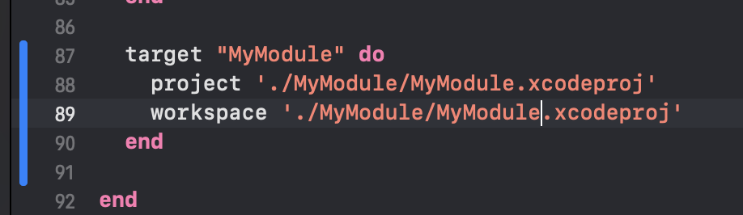

# Documentation

Content:
* [Architecture](#architecture)
  + [Philosophy](#philosophy)
  + [Concept](#concept)
  + [What is Clean Architecture?](#what-is-clean-architecture)
  + [Layers](#layers)
      - [Presentation](#presentation)
      - [Domain](#domain)
      - [Data](#data)
  + [Example](#example)
  + [FAQ](#faq)
      - [How does Clean Architecture improve software development?](#how-does-clean-architecture-improve-software-development)
      - [Can Clean Architecture be used with any programming language?](#can-clean-architecture-be-used-with-any-programming-language)
      - [Is Clean Architecture applicable only for large-scale applications?](#is-clean-architecture-applicable-only-for-large-scale-applications)
      - [How is data validation handled in Clean Architecture?](#how-is-data-validation-handled-in-clean-architecture)
      - [How are errors handled in Clean Architecture?](#how-are-errors-handled-in-clean-architecture)
      - [What are Interactors in Clean Architecture?](#what-are-interactors-in-clean-architecture)
      - [How do you deal with performance in Clean Architecture?](#how-do-you-deal-with-performance-in-clean-architecture)
      - [Is Clean Architecture the same as Hexagonal Architecture?](#is-clean-architecture-the-same-as-hexagonal-architecture)
  + [Useful links](#useful-links)
* [Project structure and Modularity](#project-structure-and-modularity)
    - [Main rule](#main-rule)
    - [Structure](#structure)
    - [Responsibility](#responsibility)
    - [Benefits](#benefits)
    - [How to create a module for your new feature?](#how-to-create-a-module-for-your-new-feature)
* [Tech Stack](#tech-stack)

# Architecture

## Philosophy
Remember ☝️

Architecture is a crucial part of developing software, but it's not a dogma.

Architecture is a set of recommendations to save you from trivial mistakes and make life easier, but if for your purpose you need to break it - you can do it.

## Concept
This project follows the architectural concept of The Clean Architecture:

## What is Clean Architecture?
It is an architectural approach that emphasizes the separation of concerns, the use of dependency inversion, and the creation of testable and maintainable code.  
It promotes flexibility by separating the application into different layers of abstraction.  
This allows for easier maintenance and testing of individual components, as well as the ability to swap out underlying technologies without affecting the overall architecture.

Architecture was popularized by Robert C. Martin ("Uncle Bob").

## Layers
Usually, implementation consists of the following three layers/packages/folders: Presentation, Domain, and Data.

### Presentation
Presentation is all about Displaying data, User input handling, Data validation, and Navigation.  
If the Presentation Layer needs data or business logic, it calls Domain Layer.

### Domain
The Domain layer, also known as the Business layer, is a key component that focuses on the core business logic, rules, and entities specific to the problem domain the application is designed to address.  
The Domain layer is **independent of any technology or infrastructure concerns**, such as databases, user interfaces, or external services.  
This separation allows the business logic to be more easily understood, maintained, and tested, without being affected by changes in other layers or components of the application.

### Data
The Data layer, or the Persistence layer, is a component of an application's architecture responsible for managing data storage, retrieval, and manipulation.
This layer serves as an abstraction between the application's core logic and the underlying data storage technology, such as databases, file systems, or external APIs.

## Example
Examples can be found in most project modules, but let's take a look at the `Course` module.  
For instance, here we can find the next structure:  
`CourseOutlineView` and `CourseContainerViewModel` as a representation of the Presentation Layer.  
`CourseInteractor` as a representation of the Domain Layer.  
And `CourseRepository` as a representation of the Data Layer.

The best way to determine **what a module does** is to open its Interactor.  
Here you can find all the business cases covered by the module.

But if you want to know **how it does it**, you must delve into its Presentation and Data layers.

## FAQ

### How does Clean Architecture improve software development?
Clean Architecture separates the concerns of software components, reduces coupling, and improves the independence of software systems.  
This makes the system more flexible, maintainable, and testable. It also ensures that the software can survive changes in technology, user interface, and even some business rules.

### Can Clean Architecture be used with any programming language?
Yes, Clean Architecture is not tied to any specific programming language.  
It's a design philosophy that can be applied to any language as long as it supports the principles of object-oriented design.

### Is Clean Architecture applicable only for large-scale applications?
No, Clean Architecture is not exclusively for large-scale applications.  
It can be implemented in small projects as well, providing similar benefits of maintainability, scalability, and testability.  
However, for very simple or small-scale applications, implementing Clean Architecture might be overkill and lead to unnecessary complexity.

### How is data validation handled in Clean Architecture?
Data validation can be considered at various levels in Clean Architecture. Simple, technical validations like checking for null or validating data formats can be done in the outer layers. Business rule validations, on the other hand, should be handled by Entities or Use Cases in the inner layers. This helps to ensure that invalid data never reaches the core business logic.

### How are errors handled in Clean Architecture?
Error handling in Clean Architecture typically depends on the type of error.  
Domain-specific errors (those that relate to the core business rules) should be handled within the Entities or Use Cases.  
Technical errors (like a database connection failing) should be handled at the outer layers, with the necessary information relayed back to the inner layers through predefined interfaces.

### What are Interactors in Clean Architecture?
Interactors, also known as Use Cases, represent specific applications of the business rules.  
They orchestrate the flow of data between Entities and the outer layers of the system.  
Interactors contain the logic to fulfill each use case of the system and maintain a decoupled relationship with the Entities and outer layers via interfaces.

### How do you deal with performance in Clean Architecture?
While Clean Architecture is not specifically designed to optimize performance, it does not inherently cause performance issues either.  
If performance becomes a concern, then performance optimization strategies can be applied in the relevant layers or components.  
However, it is recommended to keep these optimizations isolated from the business rules to preserve the separation of concerns.

### Is Clean Architecture the same as Hexagonal Architecture?
While there are similarities between Clean Architecture and Hexagonal Architecture (also known as Ports and Adapters) in terms of their goal of separation of concerns and testability, they are not the same.  
Both architectures advocate for isolating business logic from external concerns, but they use different metaphors and structures.  
Clean Architecture tends to focus more on layers, while Hexagonal Architecture emphasizes the interaction points (ports) and their implementations (adapters).

## Useful links
If you want to delve deeper into the topic of CA, you can find useful links below.

Article: [Clean Architecture for mobile: To be, or not to be](https://medium.com/globant/clean-architecture-for-mobile-to-be-or-not-to-be-2ffc8d46e402)

Video: [Robert C Martin - Clean Architecture and Design](https://www.youtube.com/watch?v=Nsjsiz2A9mg)

Book: [Clean Architecture: A Craftsman's Guide to Software Structure and Design (Robert C. Martin Series)](https://www.amazon.com/Clean-Architecture-Craftsmans-Software-Structure/dp/0134494164)

# Project structure and Modularity
Modular architecture in applications pertains to the practice of decomposing an app's elements into smaller, reusable, and interchangeable modules.  
Each Feature in the application is represented by a specific module, so you will not have problems finding the right class or functionality.

## Main rule
Lower modules don't know anything about the higher modules.  
It helps avoid conflicts with circular dependencies.

If you need to pass some logic from one independent module to another, it is not a good idea to link modules to each other, this will eventually lead to circular dependencies and the broken project.  
The better way is an abstraction in the core, implementation in the module, and dependency injection.

## Structure

## Responsibility
Each module is centered around a specific set of features or functionality.
1. App module - app lifecycle management, routing, dependency control.
2. Auth Module - anything related to the user authorization process.
3. Discovery Module - anything related to the course catalog and search.
4. Dashboard Module - anything related to the course dashboard.
5. Profile Module - anything related to a user profile and settings.
6. Course Module - anything related to course structure, certificates, and assessments.
7. Discussion Module - anything related to course discussions.
8. Core Module - a set of utilities and abstractions required by each module.

## Benefits
Modular approach has several benefits such as:

#####  Improved code organization
By separating components into modules, developers can better understand and manage the structure of the codebase.  
This organization facilitates code navigation and makes it easier to locate specific functionalities.

#####  Scalability
Since modules are self-contained, it's easier to add or remove features as the application grows.  
This flexibility allows developers to build scalable apps that can evolve with changing requirements.

#####  Reusability
Modular architecture promotes the creation of reusable components, which can be easily shared across multiple projects or within different parts of the same project.  
This reusability can lead to increased productivity and reduced development time.

#####  Faster build time
Modular architecture allows incremental builds, where only the modified modules are recompiled.  
This approach can significantly reduce build times and improve the development workflow.

## How to create a module for your new feature?
1. Go to File -> New -> Project...

2. Select `Framework` from Templates and click the Next button.

3. Change your module name, choose Team and click the Next button.

4. Select your project folder and don't forget to add the new module to the OpenEdX project group.

5. Add your new module to the Podfile.

6. Go to the project settings of the new module and add `Configurations` as shown in the screenshot below.

7. Go to your new module target and click `+` sign to add the `Core` module.

Choose `Core.framework` from the list.

Change Embed flag to `Do Not Embed`.  
The Core module will be embedded via the App module.

8. In the same way, add your new module to the OpenEdX target.

9. Navigate to the project folder and run `pod install`.

10. Optional step. Add `.gitignore`, `SwiftGen`, and a Test target to your module.

# Tech Stack
The project tries to use only the required number of libraries and frameworks and avoid unnecessary dependencies.  

The following technologies are used in the project:
- Swift, the main programming language.
- Swift Concurrency, the main toolkit for managing async jobs.
- SwiftUI, the main toolkit for building UI.
- SwiftUIIntrospect, SwiftUI backward UIKit access.
- Alamofire, HTTP networking library.
- Kingfisher, images loading library.
- Swinject, dependency injection framework.
- CoreData, data persistence.
- Firebase, infrastructure.
- XCTest, unit testing framework.
- SwiftyMocky, framework for automatic mock generation.
- SwiftLint, a tool to enforce Swift style and conventions.
- SwiftGen, the Swift code generator for assets.
